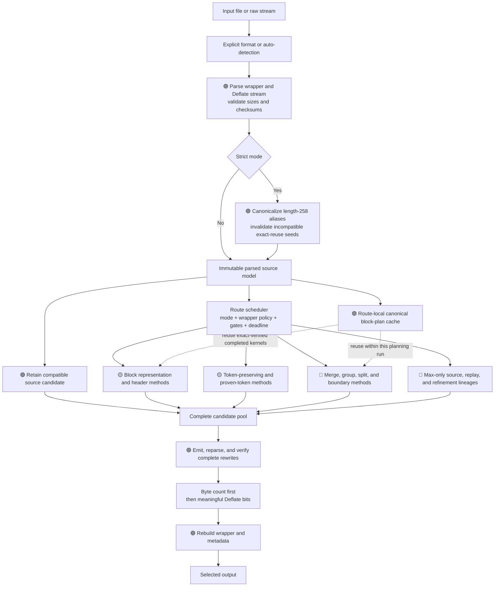
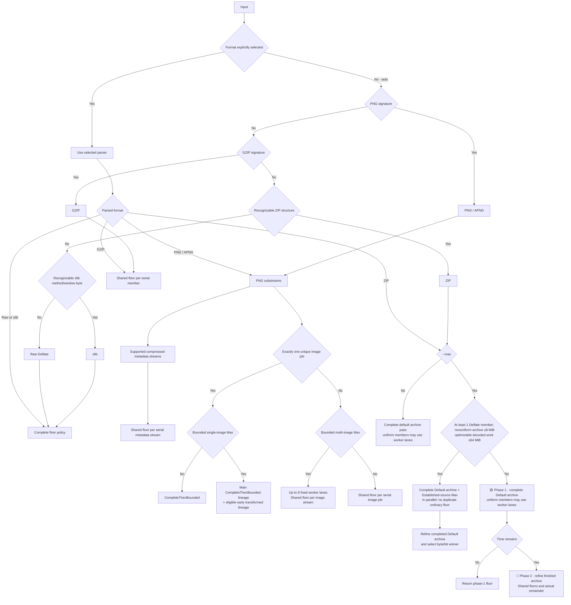
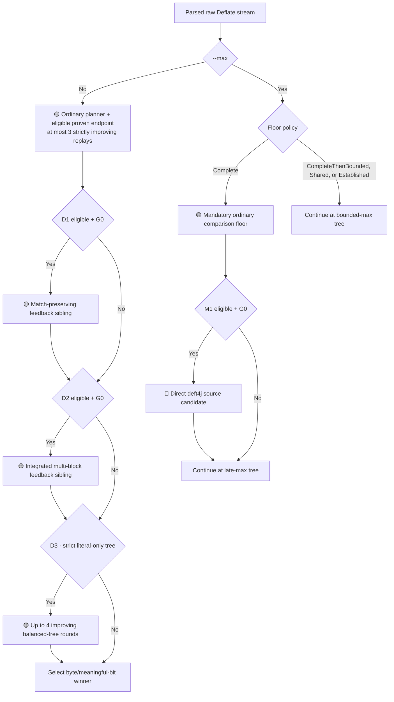
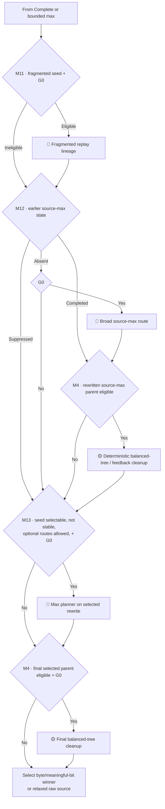
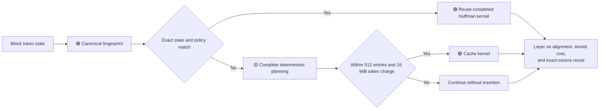

<!-- SPDX-License-Identifier: MIT -->

# Columbo routes and optimization methods

This document describes the routes and methods implemented by the current
Columbo source tree. It is a source-grounded map, not a promise that every
optional route will run for every input: format, topology, work, memory, mode,
and deadline gates decide which complete candidates are built.

Columbo is a **post-optimizer**. It preserves the decoded byte stream and works
from literals, matches, blocks, and Huffman information already proved by the
source. It does not run a new LZ77 match finder, choose a new match distance, or
delegate recompression to Zopfli, libdeflate, or another compressor.

The routing ground truth lives primarily in:

| Area | Source |
| --- | --- |
| File and wrapper dispatch | `src/format/mod.rs`, `png.rs`, `zlib.rs`, `gzip.rs`, `zip.rs` |
| Raw-stream scheduling, floors, replays, and deadlines | `src/deflate/optimize.rs` |
| Stream grouping, merging, splitting, and boundary search | `src/deflate/stream.rs` |
| Token transformations and proven-submatch search | `src/deflate/search.rs` |
| Representation selection and route-local plan cache | `src/deflate/block.rs` |
| Huffman construction and dynamic-header search | `src/deflate/huffman.rs`, `header.rs` |
| deft4j-derived source route | `src/deflate/deft4j.rs` |

Thresholds below are implementation work bounds, not Deflate format limits.
Parser validity checks and the configurable input/decoded safety limits still
apply before or around every route.

## Speed legend

| Indicator | Speed | Meaning |
| --- | --- | --- |
| 🟢 | Fast | Small, bounded work; normally close to linear in the relevant bytes, blocks, or tokens. |
| 🟡 | Medium | Rebuilds and compares several trees, token spellings, or block layouts. |
| 🔴 | Slow | Searches broad token, table, merge, replay, or boundary state, especially in max mode. |

The indicators are relative. A 🟢 method can still be noticeable on a very
large stream or a container with many streams. A method spanning two classes
uses the slower indicator.

## Overall pipeline

Candidate ordering is strict and stable: fewer output bytes wins; at equal byte
length, fewer meaningful Deflate bits wins; an exact tie retains the earlier
candidate. Therefore a same-byte result that saves **one meaningful bit** is a
real win, and the CLI will write it unless `--dry-run` is used. A padding-only
change outside the meaningful Deflate bit count is not reported as a saving and
does not replace a file solely for compression.

For raw Deflate candidate selection, relaxed mode retains the original unless a
generated stream wins under that ordering. A wrapper can still be rebuilt for a
wrapper-level normalization, notably zlib FLEVEL. Strict mode may instead have
to emit a larger standards-compatible raw stream when the source uses a
noncanonical length-258 spelling or an incompatible Huffman alphabet.

## Routing decision tree

This section covers every condition that decides whether a top-level candidate
route runs. The diagrams use gate IDs; the tables immediately below give the
complete conditions. Lower-level block and boundary gates are listed separately
under [Inner stream-planner gates](#inner-stream-planner-gates).

| Term | Meaning in the routing diagrams |
| --- | --- |
| Candidate | One complete encoded alternative that can be compared with the source or another complete alternative. |
| Floor | A complete, safe baseline candidate secured before optional broader search. |
| Lineage | A sequence of transformations or replays starting from the same source or rewritten floor. |
| Fixed point | A completed replay that reproduces the same bytes and meaningful-bit count, proving that the same planner need not run again on that encoding. |
| `Complete` | Standalone raw/zlib and ZIP-default policy: finish the ordinary comparison route before max-only work for that stream. |
| `CompleteThenBounded` | Single unique PNG image-job policy: preserve the complete default result, then give max routes a bounded shared schedule. |
| `Shared` | GZIP-member, PNG-metadata, multi-image PNG, and ZIP-max refinement policy: use a bounded per-stream floor so surrounding work retains time and decoded-size budget. |
| `Established` | A caller already retains this complete, validated stream as its floor. Copy it into a new Max lineage without rebuilding Default; every selectable descendant is still reparsed and identity-checked. |

### Wrapper and floor-policy routing

`Shared` means a bounded per-stream floor and deadline policy. It does **not**
mean that separate members share a Huffman tree, candidate, or worker.

| Wrapper route | Exact gate and scheduling behavior | Indicator |
| --- | --- | --- |
| Auto detection | In order: PNG signature, GZIP signature, recognizable ZIP structure, recognizable zlib method/window byte, then raw Deflate. | 🟢 |
| Raw / top-level zlib | Uses `Complete`; default and max route families run serially. | 🔴 |
| GZIP | Up to 16,384 concatenated members run serially in source order with one file deadline and cumulative decoded budget; every raw member uses `Shared`. | 🟡 |
| PNG metadata | Compressed `zTXt`, compressed `iTXt`, and `iCCP` zlib streams use `Shared`. A quiet non-Max stream not selected for stripping and no larger than 4,096 bytes may receive a 100 ms probe, under a 64 MiB compressed-plus-decoded probe-work budget. Max instead precomputes and caches complete Default metadata floors before image search when aggregate compressed metadata is ≤64 MiB. If time remains after image work, reconstruction continues each cached floor through `Established` Max routes; the second validation uses its known exact decoded size and does not charge the container budget twice. Larger sets retain the streaming schedule. The unknown-unsafe-ancillary early return is the exception. | 🟡 |
| PNG / APNG image data | IDAT is always its own job. Exact-compressed duplicate fdAT frames share one optimization job only when both compressed bytes and exact decoded size match. Every IDAT/fdAT stream must decode to the exact IHDR/fcTL scanline size, including Adam7 passes. Exactly one job uses `CompleteThenBounded`; two or more use `Shared`. Bounded multi-image Max work (≤8 MiB compressed and ≤64 MiB decoded in aggregate) uses up to eight fixed worker lanes with a 4% container margin; each lane runs its small-to-large slice serially. Other work retains the serial small-first schedule. | 🔴 |
| PNG single-image Max | For ≤8 MiB compressed and ≤64 MiB decoded, the main `CompleteThenBounded` lineage races an early transformed lineage only when the source has a same-distance graph above the complete 512-match bound, or when a 2+-block stream of ≤768 KiB would otherwise serialize exact Default. The early lineage spends one fifth on an ordinary parent, then refines it through `Established`; the exact Default lineage remains the quality floor. | 🔴 |
| PNG decoded-equivalent frame reuse | After serial job optimization, checksum/size groups are decoded and byte-compared before the best compressed spelling is reused. Retained comparison data is capped at 32 MiB and comparison work at 64 MiB. | 🟡 |
| PNG unsafe ancillary fallback | If an unknown ancillary chunk is unsafe to copy and `--strip` does not remove it, Columbo validates every image stream and then preserves the complete source PNG. Metadata syntax was parsed and any completed metadata probe was validated, but an unprobed metadata payload is not definitively decoded on this early return. | 🟢 |
| ZIP member scheduling | Unencrypted, nonempty method-8 entries are optimization jobs; unencrypted stored entries are validated but not Deflate-optimized, and encrypted entries are preserved without payload decoding. Default is largest-first and Max is small-first. A quiet archive with at least eight optimizable members, no member owning more than one eighth of compressed payload, input ≤8 MiB, and decoded work ≤64 MiB uses up to eight balanced worker slices. Each Max worker budgets only its own serial slice. Other passes remain serial. | 🟡–🔴 |
| ZIP max archive lineages | An archive with at least one optimizable member races its complete Default archive against direct original-source Max when member work is nonuniform, input is ≤8 MiB, and total optimizable decoded work is ≤64 MiB. The direct branch uses the validated source as `Established`, so it does not rebuild the ordinary floor owned by the Default branch. Larger archives complete Default once and refine it with the actual remainder. Uniform many-member and stored-only archives also use that single-lineage outer schedule because a second complete archive adds no useful work. All complete archives are selected by bytes then meaningful bits. | 🔴 |

### Raw-stream route tree

Any diamond labelled `+ G0` rechecks the soft route deadline and sibling
cancellation state at that point. Deterministic cleanup that has already been
admitted is explicitly labelled and may finish after the soft boundary.

#### Default and standalone max

#### Bounded max

```mermaid
flowchart TD
    START["Max + bounded floor policy"] --> EST{"Established"}
    EST -- "Yes" --> EFLOOR["Retain caller-validated complete floor"]
    EST -- "No" --> M0{"M0 · prebuild floor"}
    M0 -- "Yes" --> PREFLOOR["Shared: bounded floor<br/>CompleteThenBounded: complete default + retained max seed<br/>eligible D1/D2 still check G0"]
    M0 -- "No" --> DEFER["Build floor inside bounded phase"]
    EFLOOR --> M1F
    PREFLOOR --> M1F["M1 · record deft eligibility"]
    DEFER --> M1F
    M1F --> M2F["M2 · record no-split eligibility"]
    M2F --> M3F["M3 · record compact proven-feedback eligibility"]
    M3F --> M4F["M4 · record compact balanced-tree eligibility"]
    M4F --> M5{"M5 · parallel work cap"}

    M5 -- "Fails" --> SERIAL["🟡 Standard serial phase<br/>floor + eligible M1/M2 under G0<br/>source max and M3 remain later"]
    M5 -- "Passes" --> BTYPE{"CompleteThenBounded"}
    BTYPE -- "No · Shared" --> SHARED["🔴 Bounded phase<br/>floor + eligible M1 under G0"]
    BTYPE -- "Yes" --> M6{"M6 · bounded PNG policy"}
    M6 -- "GenericParallel" --> GENERIC["🔴 Source max worker + floor lineage<br/>M1/M2 are ineligible by definition"]
    M6 -- "Standard" --> STANDARD["🔴 Floor + eligible M1/M2 under G0"]
    M6 -- "FloorExpansion" --> M10A{"M10a · dependency-first deft case<br/>M1 + G0"}
    M10A -- "Yes" --> PREDEP["🟡 Prebuild/refine deft prerequisite"]
    M10A -- "No" --> M8
    PREDEP --> M10CPRE{"M10c · dependency split parent admitted"}
    M10CPRE -- "Yes" --> PREDSPLIT["🟡 Deterministic compact split cleanup"]
    M10CPRE -- "No" --> M8
    PREDSPLIT --> M8{"M8 · compact initial source-max class"}
    M8 -- "No" --> EXPAND
    M8 -- "Yes" --> M9{"M9 · choose source-max / M3 token owner"}
    M9 --> EXPAND["🔴 FloorExpansion phase<br/>floor + eligible M1/M2<br/>source/M3 workers per M8/M9"]

    SERIAL --> M7
    SHARED --> M7
    GENERIC --> M7
    STANDARD --> M7
    EXPAND --> M7{"M7 · floor admitted + route window open"}
    M7 -- "No" --> POST
    M7 -- "Yes" --> DESC{"GenericParallel or FloorExpansion"}
    DESC -- "Yes" --> SEEDED["🔴 Established-floor max descendant"]
    DESC -- "No" --> MULTI{"Reparsed floor has multiple nonempty blocks"}
    MULTI -- "Yes" --> GROUP["🟡 Standalone bounded grouping"]
    MULTI -- "No" --> POST
    SEEDED --> POST
    GROUP --> POST["Bounded phase rejoined"]

    POST --> M3POST{"M3 eligible, not completed, + G0"}
    M3POST -- "Yes" --> M3RUN["🟡 Proven-feedback sibling"]
    M3POST -- "No" --> S0
    M3RUN --> S0{"S0 · proven candidate ties floor bytes<br/>and wins meaningful bits"}
    S0 -- "Yes" --> SINTEGRATED["Later source max uses integrated compact order"]
    S0 -- "No" --> SORDINARY["Later source max uses ordinary order"]
    SINTEGRATED --> M10CSEED
    SORDINARY --> M10CSEED{"M10c · M4 flag + floor-seeded split parent admitted"}
    M10CSEED -- "Yes" --> SEEDSPLIT["🟡 Deterministic compact split cleanup"]
    M10CSEED -- "No" --> M4SEED
    SEEDSPLIT --> M4SEED{"M4 · resulting floor-seeded parent eligible"}
    M4SEED -- "Yes" --> M4SEEDRUN["🟡 Deterministic balanced-tree / feedback cleanup"]
    M4SEED -- "No" --> M10B
    M4SEEDRUN --> M10B{"M10b · bounded deft / weak-split lineage"}
    M10B -- "Applicable" --> M10RUN["🔴 Timed refinements start under G0<br/>admitted compact cleanup may finish deterministically"]
    M10B -- "Not applicable" --> M10CPOST
    M10RUN --> M10CPOST{"M10c · normal/direct/refined parent admitted"}
    M10CPOST -- "Yes" --> POSTSPLIT["🟡 Deterministic compact split cleanup"]
    M10CPOST -- "No" --> LATE["Continue at late-max tree"]
    POSTSPLIT --> LATE
```

#### Late max sequence

Together the three diagrams expose every top-level gate. They are eligibility
and dependency maps: M1–M4 are first recorded as booleans for the bounded
phase, not started on those four arrows. Independent eligible branches may
overlap where M5 and the thread-site gates allow it, then rejoin in a fixed
comparison order.

### Route-gate reference

| Gate | Complete condition | Effect |
| --- | --- | --- |
| G0 · timed-route start | A new independent timed route starts only before its soft deadline and while no sibling cancellation flag is set. Active work that polls the hard deadline may finish until configured timeout + 10% + 1 second; a zero timeout has no grace. Multi-route bounded phases normally receive 4/5 of the then-remaining soft time, reserving 1/5 for follow-up. | Stops new timed starts; never skips parsing, validation, or a complete fallback. An already admitted deterministic cleanup may use a no-expiry callback and finish after G0 closes. |
| D1 · match-preserving default feedback | A complete non-exhaustive/default-floor pass; exactly one parsed block; at least one match; at most 4,000 tokens and 80,000 decoded bytes. | Runs proven-before-feedback and ordinary endpoint orders as independent complete candidates. Default mode and a prebuilt `CompleteThenBounded` floor can use it; standalone `Complete` max omits this extra sibling. |
| D2 · integrated default feedback | A complete non-exhaustive/default-floor pass; 2–4 parsed blocks; compressed stream at most 16 KiB; decoded stream at most 128 KiB; at most 16 Ki tokens total; at least one block satisfies D1's match/token/plain eligibility. | Runs a compact multi-block integrated-proven candidate in default mode or a prebuilt `CompleteThenBounded` floor; standalone `Complete` max omits it. Its second endpoint replay runs only if the first candidate did not beat the incumbent and hard time remains. |
| D3 · strict literal-only balanced tree | Strict complete Default/default-floor pass; source compressed bytes ≤8 KiB; exactly one nonempty dynamic source block; ≤4,096 tokens; no distance symbols. | Runs up to four strictly improving one-block balanced-tree rounds. Each round ranks bounded pair and quad moves with the ordinary header grid, exhaustively finalizes only the winning tree, reparses the complete candidate, and stops at a fixed point. This structurally targets the complete-distance-alphabet overhead that strict mode cannot omit. |
| M0 · bounded-floor prebuild | Max plus `Shared` always prebuilds a bounded floor. Max plus `CompleteThenBounded` prebuilds when nonempty blocks ≤1, decoded bytes ≤768 KiB, decoded bytes >2 MiB, or more than 512 matches belong to source same-distance runs. `Established` directly retains the complete caller-provided floor; `Complete` never prebuilds here. | Otherwise the multi-block single-image PNG floor is built inside the bounded phase. |
| M1 · deft4j source | Max. With exactly one nonempty block: floor policy must allow a single-block route (`Complete` or `CompleteThenBounded`) and the block must be fixed/dynamic. With 2–128 nonempty blocks: at least two must be fixed/dynamic. Other counts are rejected. | Adds the direct deft4j-derived source candidate. |
| M2 · no-split source | Max + `CompleteThenBounded`; compressed bytes ≤512 KiB; 2–128 nonempty blocks; every nonempty block fixed/dynamic. | Adds the bounded narrow source route. |
| M3 · compact proven feedback | Max + `CompleteThenBounded`; exactly one parsed block; at least one match; ≤4,000 tokens; ≤80,000 decoded bytes. | Schedules the proven-first sibling in the initial phase under M8/M9, or tries it after that phase if it has not completed and G0 remains open. |
| M4 · compact balanced tree | The top-level flag requires max + `CompleteThenBounded`, compressed bytes ≤8 KiB, decoded bytes ≤128 KiB, exactly one nonempty dynamic source block, and ≤4,096 tokens in that block. Each rewritten parent must parse as exactly one dynamic block with ≤4,096 tokens and a retained source dynamic-tree seed. | On floor-seeded and source-max parents, admitted pair/quad tree and feedback cleanup is deterministic and needs no new G0 start; the final selected-parent trial does require G0. Max exactly prices every prospective quad tree and, for an empty distance alphabet, every pair tree. Matched Max streams omit the pair family because their independent token/boundary lineages cover the useful work and the duplicate search can delay larger wins. Each move permits at most 18 extra payload bits and survives only when complete header-plus-payload pricing wins. |
| M5 · route-level parallel cap | Max + bounded floor policy (`CompleteThenBounded`, `Shared`, or `Established`); compressed bytes ≤8 MiB; decoded bytes ≤64 MiB; estimated parsed model ≤64 MiB. | Allows broad independent candidate arenas to overlap. Failure selects Standard scheduling: floor, eligible M1/M2 routes, and dependent work remain serial, M8 is disabled, and source max remains eligible later; it does not promise an equivalent deferred floor-max descendant. |
| M6 · bounded PNG policy | Evaluated only for `CompleteThenBounded` after M5. `GenericParallel` when neither M1 nor M2 is eligible. Otherwise `FloorExpansion` when source has ≥2 nonempty blocks or the completed floor changes nonempty boundaries/token arrays. Otherwise `Standard`. | Chooses which independent source and floor lineages own the initial wall-clock window. |
| M7 · floor descendant | The floor must be selected (`strict` or strictly smaller than source) and its bounded route window must remain open. `GenericParallel` and `FloorExpansion` run an established-floor max descendant. Standard scheduling may instead run standalone bounded grouping when the reparsed floor has multiple nonempty blocks. | The established-floor max and standalone grouping descendants are mutually exclusive. |
| M8 · initial compact source max | `FloorExpansion` + M5; compressed bytes ≤16 KiB. One nonempty block additionally needs decoded bytes ≤128 KiB, or ≤16 Ki tokens plus at least two repartition runs. For 2–4 nonempty blocks: decoded bytes ≤128 KiB × block count, ≤16 Ki tokens, and at least two repartition runs. | Makes source max eligible for the initial bounded worker phase. |
| M9 · compact source-token owner | Given M8: keep both roots when total tokens ≤2,048. In the 2,500–4,000-token band, source max alone owns the work when M3 exists and topology is distinct (a repartition run exists or decoded bytes >65,535). Otherwise source max requires at least two repartition runs or no M3 route; M3 is suppressed only when the single-owner source route actually starts. The 2,049–2,499 gap therefore normally favours M3 unless there are at least two repartition runs. | Avoids two long workers traversing substantially the same compact token graph. |
| S0 · source-max state order | A completed M3 candidate has the same byte length as the normal bounded floor but fewer meaningful bits. | Later source max begins with integrated compact proven order. A byte win, byte loss, or exact tie retains ordinary order; an already-running initial source max is unaffected. |
| M10a · dependency-first deft | `FloorExpansion` + M1 + G0, and either a unique one-nonempty-block floor descendant or a compact multi-block source: compressed ≤16 KiB, decoded ≤128 KiB, tokens ≤16 Ki, multiple nonempty blocks, and a non-dense repartition graph. Dense means every nonempty block has ≤4,000 tokens and repartition-run count ≥ nonempty-block count. | Prebuilds and ordinarily refines the direct deft parent before long independent beams; the compact multi-block case also completes its admitted split descendant. |
| M10b · bounded deft refinement | A bounded policy and G0. A weak deft signal requires `CompleteThenBounded`, a completed deft candidate, multiple nonempty blocks, and <2% meaningful-bit gain. Re-seeding from the normal floor requires that floor to strictly beat the source. In that weak floor-reseed branch, ordinary replay and terminal merge each recheck G0; terminal merge also requires a seed ≤512 KiB and no already-better M2 candidate. Refinement of an existing direct deft candidate uses the single M10b admission check. | Refines the direct or floor-seeded deft lineage while eligible independent work may run. |
| M10c · compact split cleanup | A prepared parent is ≤16 KiB compressed and reparses to 2–4 blocks, none empty or stored, ≤128 KiB decoded, ≤16 Ki tokens, with at least one block having ≥16 tokens and ≥128 decoded bytes. A later refined parent must be nonduplicate and either beat every early parent or still pass G0. | Prices ordinary, floor-seeded, direct-deft, and admitted refined-deft parents. Once admitted, deterministic rescue/finalization may finish after the soft boundary. |
| M11 · fragmented collection | Max; optional routes not suppressed; G0; at least 64 source blocks; encoded source size 16,000–100,000 bytes; no stored source block. Collection uses ≤4,096 tokens and ≤512 KiB plain per run and must produce fewer source blocks and 2–8 collected blocks. | Replays the independent fragmented seed for at most eight max rounds; replay itself accepts 1–12 non-stored blocks. |
| M12 · later source max | Max. Reuse an earlier completed source-max candidate; skip when policy marked it suppressed; otherwise start the broad route only while G0 remains open. | Ensures original-source max precedes a rewritten seed without repeating an initial source-max route. |
| M13 · rewritten-seed refinement | Max; selected candidate is allowed (`strict` or it beats the source); no exact unexpired max-planner fixed point; optional routes not suppressed; G0. | Reparses and runs the max planner from the selected rewrite. |

Standalone `Complete` max mode first builds an ordinary candidate with the
non-max stream planner and independent proven endpoint. The additional D1/D2
siblings run in default mode and in an eligible prebuilt complete single-image
PNG floor, but standalone `Complete` max omits them. Ordinary/default and
compact-feedback lineages use at most three replays; broad, floor-seeded, and
fragmented max lineages use at most eight; terminal merge uses at most two;
direct deft and no-split candidates use no replay until an explicitly
scheduled refinement.
A round is adopted only on a strict byte/meaningful-bit win. An unexpired
exhaustive round establishes a fixed point only when it reproduces the same
bytes and meaningful-bit count.

## Inner stream-planner gates

These gates are below the top-level scheduler. They control which block-layout
and boundary methods contribute to an already-started route.

| Method | Exact gate | Indicator |
| --- | --- | --- |
| All-stored repack | At least two blocks, every block stored, and total decoded bytes ≤64,000,000. Rechunk to payloads ≤65,535 bytes. | 🟢 |
| Regroup family | Floor work remains and either max is enabled or encoded source size is 16,000–100,000 bytes. | 🟡 |
| Source-aligned floor | Regroup allowed; 2–8 source blocks; no stored block. Each candidate range remains ≤250,000 tokens and ≤64,000,000 decoded bytes, and the optional composite model must stay within 48 MiB. | 🟡 |
| Whole-stream merged replay | Within an eligible source-aligned floor, the full merged range has ≥100,000 decoded bytes. A transformed fixed/dynamic seed no more than 256 bits above the best immediate recode may receive extended-floor replay at ≤50,000 tokens/10,000,000 decoded bytes and a four-step table ladder at ≤100,000 tokens/10,000,000 decoded bytes. | 🟡 |
| Greedy and bounded grouping | Ordinary regroup uses 9–128 blocks; the floor-seeded standalone form uses 2–128. Both reject a stored source block and require twice retained payload storage ≤48 MiB. Bounded grouping prices spans of at most 16 and also aborts if independently planning any source block selects a stored representation. | 🟡 |
| Collected and wide-collected layouts | Regroup allowed and >8 blocks. Three times retained payload storage must be ≤48 MiB and output is capped at 2,048 blocks. Bounded runs use ≤8,192 tokens/512 KiB plain. Wide collection is added in max or at ≥128 blocks, uses the normal 250,000-token/64,000,000-byte merge caps, and must differ from bounded collection. | 🟡 |
| Mandatory token floor | At most 128 blocks; the extended compact feedback floor applies only at ≤8 blocks. If same-distance repartition opportunities exist, proven resegmentation is integrated before feedback; otherwise proven search remains an independent endpoint lineage. | 🟡 |
| Selected-plan merge cleanup | Max; the searched source-order plan strictly replaced the fallback; 2–8 alignment-independent Huffman blocks; ≤8,192 tokens and ≤512 KiB plain. | 🟡 |
| Per-source split | Otherwise falls back to whole-block search when tokens <16, decoded bytes <128, or default decoded bytes <32,768. Eligible blocks receive seven decoded-eighth probes. Max blocks ≤512 tokens also receive every interior 32-token anchor, capped with the source cut set at 32. | 🔴 |
| Exact inside-match siblings | Max always admits them. Default admits them when `token_count × 7 ≤ 32,768`. A source's own exact eighths still need ≥16 tokens, ≥128 decoded bytes, and in default ≥32,768 decoded bytes. With regroup and ≤8 sources, compact default as well as max also adds exact siblings for combined Huffman runs and their 2+-source subgroups; every combined interval still needs ≥16 tokens and ≥128 decoded bytes. | 🔴 |
| Default nested split | At least two exact-priced split candidates and runner-up cost within 64 bits of the best; refine only the larger child around its midpoint. Retain the snapped midpoint and, when the compact default inside-match gate passes, an exact inside-match sibling, for at most two nested cuts. | 🟡 |
| Adaptive split | Max; 513–250,000 tokens, at least 128 decoded bytes, a usable range histogram, and a cut not already present. At most 128 sample/probe positions; accept only after exact structural planning saves at least 32 bits. | 🟡 |
| Priority boundary graph | Max + established comparison floor + regroup + exactly one block + ≤8,192 tokens + ≥100,000 decoded bytes + at least two same-distance repartition runs. | 🔴 |
| Global boundary graph | Regroup allowed, deadline remains, and more than two distinct cuts exist. Building the composite and its range state must stay within the 48 MiB optional-model cap. Token-boundary cuts are retained before optional inside-match cuts; total cuts ≤2,048. | 🔴 |
| Boundary edge legality | Default same-source edges must touch that source's start or end; max may take middle ranges. Max cross-source edges stay ≤250,000 tokens/64,000,000 plain bytes. Stored edges cover whole sources and ≤65,535 bytes; mixed stored/Huffman ranges are rejected. Default cross-source Huffman ranges require regroup and ≤8 sources plus a touched source boundary, except ≤512-byte whole-source or all-fixed whole-source cases. Every legal edge is priced over all eight starting bit residues. | 🔴 |
| Adjacent merge | Merge search is enabled and either combined plain ≤512 bytes, max is enabled, or the route selected long-run Huffman merging; combined range ≤250,000 tokens/64,000,000 bytes. Exact fixed/fixed joining and identical-source-dynamic-tree reuse have cheaper dedicated candidates. | 🔴 |
| No-split route | Uses a complete direct fallback, narrow whole-block searches, and long-run adjacent merging; omits grouping, split probes, global boundary search, broad state queues, and iterative replay. | 🟡 |

### Inner token-search gates

| Method | Exact gate | Indicator |
| --- | --- | --- |
| Same-distance candidate | At least two tokens and one adjacent same-distance run; retain only a strict complete-block bit win. Non-exhaustive structural floors—including such floors inside max—use exact deficit pricing only when active shortened matches ≤16. Full max token search admits the wider bounded deficit table. | 🟢 |
| Mandatory block floor | ≤50,000 tokens and ≤10,000,000 decoded bytes. | 🟡 |
| Ordinary short-family floor | ≤250,000 tokens and ≤64,000,000 decoded bytes; price cumulative symbol ranges 260, 260–261, through 260–264. | 🟡 |
| Compact short-band floor | ≤12,000 tokens and ≤80,000 decoded bytes; price prefixes ending at 257, 258, 259, 260, 262, and 264. | 🟡 |
| Large no-split bands | Narrow/no-split block search only; decoded bytes ≥128,000 and tokens ≤80,000. Price cumulative endpoints 262, 265, 267, 269, and 270 plus the sparse 260–270-and-280 family. | 🟡 |
| All-literal endpoint | Decoded bytes ≤12,000 and either tokens ≤4,000, or tokens ≤20,000 with at most 32 matches. | 🟡 |
| Match-expansion ladder | Begins only when matches exist; follows each seed for at most 12 token-expansion states, retaining strict winners and useful non-larger intermediates according to the route policy. | 🔴 |
| Match groups | Max; ≤250,000 tokens and ≤10,000,000 decoded bytes. For each of at most two deduplicated table seeds, price up to 20 individual groups and the first 2-, 3-, 4-, and 5-group prefixes. | 🔴 |
| Individual match pruning | Default: ≤20,000 tokens, ≤10,000,000 decoded bytes, and ≤32 matches. Max's dedicated individual-prune root is limited to ≤4,000 tokens; it shares exact state deduplication with the intact root. | 🔴 |
| Ordered token-state queue | Max; ≤12,000 tokens and ≤80,000 decoded bytes. Beam width 8, depth 5, at most 6 children per state, with a 256-bit admission margin. | 🔴 |
| Transformed-winner replay | Max; after a transformed token winner, at most four non-max child rounds. Outside block search, ordinary/compact lineages use at most three rounds, broad max lineages eight, terminal merge two, and direct/no-split routes zero until separately refined. | 🔴 |
| Terminal tightening | Huffman plan ≤50,000 tokens and ≤10,000,000 decoded bytes. Extended floor replay uses the same bound; the four-pass table ladder allows ≤100,000 tokens at the same decoded bound. | 🟡 |

The stream planner secures a complete structural/token floor before optional
search. With more than eight source blocks, default can search the selected and
collected layouts but returns before the broad cross-source boundary graph. If
regroup is disabled, it returns after the per-source work. Max may continue into
the global graph until its deadline.

## Same-distance match-run normalization

🟢 A maximal sequence of adjacent matches using one semantic distance forms a
proven run. If it decodes `S` bytes, the minimum legal match count is
`ceil(S / 258)`:

- A run of at most 258 bytes becomes one canonical match.
- An exact multiple of 258 becomes all 258-byte matches.
- Other runs use a bounded deficit search under current Huffman costs.

Non-exhaustive structural work uses the exact cost search when at most 16
shortened matches are active; otherwise it emits a legal minimum-token fallback
requiring at most two shortened matches. This remains true for structural floors
inside max. The full max token search keeps the wider bounded cost table. The
distance never changes, the history window is never searched, and the complete
block is replanned before adoption.

Verbose mode reports source-only opportunity counters:

- Maximal same-distance runs.
- Matches and decoded bytes in those runs.
- Direct coalesces and longer repartition opportunities.
- Maximum removable match tokens.

The counter joins source token lists, so a source block boundary does not end a
reported opportunity. The transformation itself can cross that boundary only
after another route has legally merged the blocks into one candidate.

## Proven-submatch resegmentation and feedback

Within one existing match, 🔴 proven-submatch search constructs an acyclic
graph over decoded positions:

- A literal edge emits the already-known byte.
- A match edge emits 3–258 bytes at the source match's distance.
- No edge leaves the source match's decoded interval.

The source match wins estimated payload ties, but Columbo also prices
source-symbol-free and highest-used-length-symbol-elimination alternatives so a
small payload penalty can expose a larger header saving. Complete materialized
spellings are deduplicated, replanned, and exactly compared.

| Policy | Gate and breadth | Indicator |
| --- | --- | --- |
| Default targeted pass | Block ≤50,000 tokens and ≤10,000,000 decoded bytes with a match. Rank at most 8 targets, at most 2 per length symbol; one pass. | 🟡 |
| Max targeted pass | Block ≤250,000 tokens and ≤10,000,000 decoded bytes with a match. Rank at most 32 targets, at most 4 per length symbol. | 🔴 |
| Compact individual trials | ≤4,000 tokens and ≤80,000 decoded bytes. Price up to 4 default or 8 max individual siblings per rewrite family. | 🔴 |
| Full max graph | ≤12,000 tokens, ≤80,000 decoded bytes, and ≤512 matches. May target every eligible match. | 🔴 |
| Max repetition | Continue only after a strict token/bit winner, until stable, deadline, or 12 passes. Highest-symbol elimination is capped at 64 matches. | 🔴 |

Ranking favours high, rare, or expensive length symbols, positions within two
decoded bytes of a length-code transition, and positions within eight bytes of
a source split. Rare means frequency ≤2; expensive means at least nine code bits
or absent from the seed tree.

The ordinary planner stabilizes proven resegmentation as an independent
endpoint lineage so a locally smaller spelling cannot hide the ordinary replay
fixed point. Compact default and single-image PNG routes additionally retain
the proven-before-feedback and integrated-proven state orders described by D1,
D2, and M3.

## Boundary polishing inside proven matches

🔴 A selected decoded cut may fall inside an existing match. Columbo retains
the snapped token-boundary candidate and may add an exact sibling at the decoded
target. A fragment of 3–258 bytes becomes a canonical match at the original
distance; a one- or two-byte fragment becomes known literals. No alternative
distance is invented.

Default exact siblings are work-bounded by `token_count × 7 ≤ 32,768`; max
admits them throughout its existing cut limits. This applies not only to
per-source eighths but, for regroupable lists of at most eight sources, to
combined Huffman runs and their subgroups. The boundary graph carries all eight
starting bit residues, so stored-block padding and Huffman representations are
compared at their real alignment. A combined run or subgroup must itself have
at least 16 tokens and 128 decoded bytes before those exact siblings are added.

The compact split floor is a separate bounded structural method. It prices
decoded-eighth splits without deep token or merge search and forwards a complete
best prefix when the deadline arrives. During finalization it can perform at
most six central-first rescue trials on the largest eligible parent while all
untouched blocks retain their exact parent representation. Its parent gate is
compressed bytes ≤16 KiB, decoded bytes ≤128 KiB, 2–4 parsed blocks, no empty or
stored block, ≤16 Ki tokens total, and at least one block with ≥16 tokens and
≥128 decoded bytes.

## Candidate reuse and duplicate-work control

The implemented cache is a **route-local block-plan cache**, not a global route
DAG or interval cache. It stores completed alignment-independent fixed,
dynamic, and header kernels for identical token states within one planning run.

A hash hit is followed by exact verification of token spelling, symbol
frequencies, source dynamic-tree seed, and strict/default-or-max policy, making
hash collisions harmless. Timed work may consume a completed entry but never
publishes a partial plan. Separate route workers own separate caches; there is
no shared cache lock between them.

Other duplicate-work controls include:

- Reusing a completed default/floor candidate before max descendants.
- Using `Established` when a PNG worker already owns the complete transformed
  parent, so the descendant does not rebuild the same ordinary floor.
- Parsing a completed bounded floor once for its grouping and Max descendants.
- Skipping rewritten-seed replay after an exact unexpired max fixed point.
- Deduplicating exact compressed APNG frames with matching decoded geometry
  before optimization.
- Exact decoded comparison before cross-frame compressed-stream reuse.
- Racing `Established` source-Max ZIP work beside exact Default only for
  bounded nonuniform archives, without rebuilding an ordinary floor in the
  direct branch.
- Completing one outer ZIP lineage for uniform many-member archives and
  distributing independent members across balanced worker slices.
- Ordering distinct compact-split parents by their completed byte/bit score,
  while retaining every parent for a sufficiently long Max run.
- Selecting one compact source-token owner when proven and source-max beams
  would substantially overlap.
- Pricing bounded grouping ranges once before selecting the least-cost ordered
  segmentation.

## Multithreading

Columbo does not parallelize files supplied to the CLI. PNG metadata, GZIP
members, and standalone raw/top-level-zlib planning remain algorithmically
serial. A structurally uniform many-member ZIP may parallelize independent
members in either mode. In bounded `--max` work, Columbo may also overlap
independent raw routes, APNG image streams, the two useful single-image PNG
lineages, or complete ZIP archive lineages. Every site has explicit compressed,
decoded, or model bounds and rejoins before wrapper reconstruction.

Broad candidate-route overlap requires **all** of M5: max mode, a bounded floor
policy, compressed bytes ≤8 MiB, decoded bytes ≤64 MiB, and parsed-model
estimate ≤64 MiB. The estimate charges token storage, decoded bytes, and
per-block model overhead. Two narrower sites use their own tighter work caps:
compact-split follow-up and floor-seeded grouping range pricing. The wrapper
sites below have their own 8 MiB compressed and 64 MiB decoded bounds. There
is no persistent thread pool or CLI thread-count option.

| Internal thread site | When it runs | Work split | Indicator |
| --- | --- | --- | --- |
| ZIP archive lineages | Max; at least one optimizable member; nonuniform member distribution; input ≤8 MiB; total decoded bytes of optimizable entries ≤64 MiB. | One worker runs original-source Max from `Established` while the caller owns all ordinary Default work and later refines that finished archive. The byte/bit best complete archive wins without duplicating a floor route. | 🔴 |
| Uniform ZIP members | Default or Max; quiet mode; at least eight optimizable entries; largest compressed member ≤1/8 of their aggregate; input ≤8 MiB; aggregate decoded bytes ≤64 MiB. | Up to eight balanced contiguous slices of the mode's entry order. Each worker owns cloned entry metadata/output and, in Max, divides time using only its own serial slice. The outer archive lineage is not duplicated. | 🟡–🔴 |
| Single-image PNG lineages | Max; compressed ≤8 MiB; exact decoded image bytes ≤64 MiB; source either exceeds the 512-match complete graph or is a 2+-block ≤768 KiB serial-floor class. | One worker builds a quick ordinary parent and continues it through `Established`; the caller preserves exact Default and the direct bounded routes. | 🔴 |
| Multi-image PNG jobs | Max; at least two unique jobs; aggregate compressed ≤8 MiB; aggregate exact decoded bytes ≤64 MiB. | Up to eight fixed lanes receive balanced contiguous slices of the small-to-large job order. Each lane runs its jobs serially with child-grace-aware proportional time; 4% remains for parse, join, and rebuild work. | 🔴 |
| Initial bounded max phase | M5 plus the individual M1/M2/M8/M9 route gates and G0. | Up to four named workers for deft4j, no-split, initial source max, and initial proven feedback; caller builds/reuses the floor lineage. `Shared` generally overlaps only eligible multi-block deft work with its floor. | 🔴 |
| Generic single-image PNG phase | `CompleteThenBounded`, M5, G0, and M6=`GenericParallel`. | One source-max worker while the caller builds the floor→seeded-max lineage. | 🔴 |
| Bounded PNG follow-up | `CompleteThenBounded`, G0, and bounded refinement remains. A source-max worker additionally requires M5 and no completed or suppressing source-max route. A compact-split worker instead requires at least one prepared weak-deft parent: multiple nonempty blocks, <2% direct deft gain, ≤16 KiB compressed, ≤128 KiB decoded, 2–4 nonempty non-stored blocks, ≤16 Ki tokens, and at least one block with ≥16 tokens and ≥128 decoded bytes. | Optional source-max and compact-split workers run while the caller refines the deft lineage. | 🔴 |
| Floor-seeded bounded grouping | The standalone grouping descendant from M7 is selected; grouping has 2–128 blocks, no stored source block, twice its retained payload storage is ≤48 MiB, and independently planning each source does not select a stored representation. | Up to four workers—further limited by available hardware threads and block count—price ranges beginning at assigned source blocks. Results return to source order, and the final best segmentation is selected serially. | 🟡 |
| CLI spinner | Quiet interactive max run with terminal stderr. | Presentation-only thread: 300 ms delay, then roughly 200 ms updates. It performs no optimization. | 🟢 |

The ordinary stream planner deliberately prices bounded ranges serially; the
parallel range-pricing step is used only by the floor-seeded grouping
continuation. If only one hardware worker is available it falls back to serial
pricing.

Worker creation is optional. A failed archive, image-lane, route, or grouping
spawn runs equivalent work on the caller when appropriate or leaves the normal
later serial route eligible. Route siblings share
immutable parsed input but own their candidate arenas and caches. An error or
panic in a candidate-route sibling requests cooperative cancellation; all
successfully started scoped workers are joined before the error is returned or
the panic resumes. Grouping workers have no cancellation flag: allocation
failure marks the range-pricing step unsuccessful, and a panic is remembered
until every worker has joined. There is no force-kill.

Completed candidates are merged in a fixed route order, and equal contenders
retain the incumbent. The range-pricing result is deterministic because every
started range completes and results are restored by source index. With a finite
wall-clock deadline, however, operating-system scheduling can still change how
far a cooperative search progresses, so timed runs are not promised to be
bit-for-bit identical.

`Options` is immutable and reusable, so callers may run independent public API
calls on their own threads. That caller-created concurrency is separate from
the internal scheduler described here.

## Method catalogue

### Wrapper and scheduling methods

| Method or route | Current behavior | Indicator | Provenance |
| --- | --- | --- | --- |
| Original raw-candidate preservation | Keeps compatible raw Deflate source bytes as the relaxed fallback; strict repairs are the documented exception. Wrapper-level reconstruction or normalization can still change container bytes. | 🟢 | **Columbo** |
| One-bit output selection | At equal byte length, any positive meaningful-Deflate-bit saving—including one bit—sets `bits_saved` and permits a CLI write. Padding-only changes do not. | 🟢 | **Columbo** |
| Complete / CompleteThenBounded / Shared / Established floors | Selects standalone, single-image PNG, multi-stream, or already-retained-parent deadline behavior without exposing wrapper policy as a public option. | 🟡 | **Columbo** |
| Parallel ZIP max lineages | For nonuniform archives with optimizable work within 8 MiB input and 64 MiB decoded bounds, races exact Default and an `Established` original-source Max branch, then refines the completed Default archive. The direct branch does not rebuild ordinary work. Larger, uniform, or stored-only archives complete Default once before Max refinement. | 🔴 | **Columbo** |
| Parallel uniform ZIP members | Runs balanced slices of at least eight similarly distributed independent members without duplicating the archive lineage; Max workers receive slice-local schedules. | 🟡–🔴 | **Columbo Rust** |
| PNG compressed-metadata scheduling | Gives small supported ancillary zlib streams a bounded early probe in non-Max quiet runs. For bounded aggregate metadata, Max first caches complete Default floors so later image work cannot consume their opportunity, then spends any remainder on `Established` descendants without rebuilding or double-charging the floor; the unknown-unsafe-ancillary early return preserves the source first. | 🟡 | Original **Columbo C** probe; **Columbo Rust** floor preservation |
| Exact PNG image geometry | Computes filtered IDAT/fdAT byte counts from IHDR/fcTL, including Adam7, and requires each zlib stream to decode to that exact size. | 🟢 | **PNG/APNG / Columbo** |
| Parallel PNG Max scheduling | Races distinct bounded single-image lineages and assigns independent APNG streams to at most eight fixed lanes, with explicit memory and wall-clock headroom. | 🔴 | **Columbo** |
| PNG duplicate and equivalent-frame reuse | Shares optimization for exact-compressed fdAT frames only when decoded geometry also matches, then uses bounded exact decoded comparison before reusing a better spelling across equivalent frames. IDAT remains a separate job. | 🟡 | **Columbo** |
| PNG packet coalescing and APNG renumbering | Coalesces IDAT/fdAT packetization, saving one 12-byte chunk envelope per removed packet, and rebuilds APNG sequence numbers. | 🟢 | **PNG/APNG / Columbo** |
| zlib effort-header normalization | Rebuilds RFC 1950 FLG with FLEVEL=3 and valid FCHECK while retaining CM/CINFO and rejecting preset dictionaries. This changes the API-selected wrapper even when the raw body is retained; the CLI still requires nonzero `bits_saved` before writing solely for compression. | 🟢 | **RFC 1950 / Columbo** |
| GZIP member scheduling | Validates and optimizes concatenated members serially with shared timeout/decoded budgets and optional metadata stripping. | 🟡 | **RFC 1952 / Columbo** |

### Block, Huffman, and token methods

| Method or route | Current behavior | Indicator | Provenance |
| --- | --- | --- | --- |
| Strict length-258 normalization | Rewrites nonstandard symbol-284 length 258 and clears stale exact-source/tree reuse data. | 🟢 | **RFC 1951 / Columbo** |
| Empty-block and adjacent-stored preparation | Removes redundant empty blocks while retaining one for an otherwise empty stream, and joins adjacent stored payloads when their combined plain length is ≤65,535 and the three-view payload model stays ≤48 MiB. | 🟢 | **Columbo** |
| Exact source-block reuse | Reuses source bits when compatible. Stored originals require their original starting residue; fixed/dynamic originals are alignment-independent, and strict dynamic reuse requires compatible complete alphabets. | 🟢 | **Columbo** |
| Stored/fixed/dynamic comparison | Prices complete legal representations with real alignment, payload, and header cost. | 🟡 | **RFC 1951 / Columbo** |
| All-stored repack | Rechunks adjacent stored payload into legal 65,535-byte blocks without token search. | 🟢 | **RFC 1951 / Columbo** |
| Strict/relaxed tree-shape policy | Strict completes required alphabets; relaxed permits explicitly supported empty or singleton forms and the compatibility length-258 alias. | 🟢 | **RFC 1951 / Columbo** |
| Route-local canonical plan cache | Reuses exact-verified completed fixed/dynamic/header kernels within one planning run. | 🟢 | **Columbo** |
| Length-limited Huffman families | Default tries DeflOpt-heap and Columbo order-heap variants; max adds generic, Columbo/Defluff, exact Defluff, and deft4j Java-heap shapes under a capped cross-product. | 🔴 | **DeflOpt / Defluff / deft4j / Columbo** as labelled in source |
| Header RLE search | Tries all eight repeat-code masks, balanced/residual variants, feedback, deft4j-pruned headers, and in max a fixed-cost shortest RLE parse. | 🔴 | **DeflOpt / deft4j / Columbo** as labelled in source |
| Adjacency-quantized RLE tree | Max only: quantizes adjacent symbol frequencies into pseudo-weights, builds one RLE-friendly Huffman pair, then prices its complete header and payload against the original frequencies. | 🟡 | Zopfli/Turtledeflate-inspired pseudo-frequency shape; **Columbo** quantizer and exact scoring |
| Equal-frequency and code-length adjustments | Uses payload-neutral equal-frequency assignments and bounded length swaps when their complete header+payload cost wins. | 🔴 | **Columbo** |
| Same-distance normalization | Coalesces or cost-repartitions adjacent matches already using one proven distance. | 🟢 | **Columbo** |
| Cumulative short-length bands | Ordinary floors price five prefixes from symbol 260 through 260–264. Compact seeds use endpoints 257, 258, 259, 260, 262, and 264. Large no-split work uses endpoints 262, 265, 267, 269, and 270 plus one sparse family containing symbols 260–270 and 280. | 🟡 | **Columbo**, inspired by deft4j least-family pruning |
| Match-to-literal alternatives | Emits known literals for selected existing matches when complete repricing wins; never finds a new match. | 🔴 | **Columbo**; labelled primitives retain DeflOpt/deft4j attribution |
| Proven-submatch resegmentation | Searches literal/match paths wholly inside an already-proved match at its original distance. | 🔴 | **Columbo** |
| Independent proven endpoint | Replays proven resegmentation after the ordinary candidate rather than allowing a local spelling to hide another fixed point. | 🔴 | **Columbo** |
| Match-preserving and integrated proven feedback | Adds the compact D1/D2/M3 state orders as independent complete candidates. | 🟡 | **Columbo** |
| Terminal tree tightening | Applies bounded feedback trees and one strictly improving existing-match-to-literal replay to eligible final Huffman blocks. | 🟡 | DeflOpt-inspired primitive; **Columbo** scheduling |
| Table replay ladder | Follows the selected table through up to four token-expansion/rebuild states, retaining the best intermediate. | 🟡 | **Columbo** |
| Compact pair lengthening | On one dynamic block, shortens one length-L code to L-1 and lengthens two other length-L codes to L+1. This preserves the Kraft sum; bounded frequency-ranked candidates may spend at most 18 payload bits and are accepted only when the complete header-plus-payload result wins. | 🟡 | **Columbo Rust** |
| Compact quad lengthening | On one dynamic block, tries the original bounded one-shorter/four-longer equal-Kraft tree family, permits at most 18 extra payload bits, and prices complete header plus payload. | 🟡 | Original **Columbo C** method |
| Compact balanced-tree cleanup | Selects the better pair/quad tree, exhaustively finalizes only Default's winning tree, and may compose Max's tree result with compact proven feedback. The structural strict literal-only Default route runs at most four improving rounds; matched Max streams avoid the duplicate pair family. | 🟡 | **Columbo** scheduling |

### Structural and max routes

| Method or route | Current behavior | Indicator | Provenance |
| --- | --- | --- | --- |
| Fixed/fixed 10-bit join | Removes one fixed end code and the next fixed header when adjacent selected blocks are fixed. | 🟢 | **DeflOpt** |
| Shared source dynamic tree | Reuses an identical source dynamic tree over concatenated tokens and removes one header when cheaper. | 🟢 | **Columbo** |
| Source-aligned floor | Prices all contiguous ranges over at most eight sources—36 ranges at eight blocks—and chooses the best source-boundary segmentation. | 🟡 | **Columbo** |
| Whole-stream recode and replay | Gives a large complete merged range one extended token-preserving floor and a near-seed table replay before a shared container deadline can starve it. | 🟡 | **Columbo** |
| Greedy adjacent grouping | Carries a strictly winning merged block into the next adjacent comparison. | 🟡 | Original **Columbo C** block-list behavior |
| Bounded grouping with ordered selection | Prices each legal span up to 16 once, then selects the least-cost complete ordered segmentation; optional floor-seeded range pricing uses at most four workers. | 🟡 | **Columbo** |
| Bounded and wide collection | Folds long Huffman runs under bounded or broad token/plain limits before replay. | 🟡 | **Columbo** |
| Selected-plan merge cleanup | Prices every adjacent pair once on a newly selected compact Huffman plan without reparsing the whole stream. | 🟡 | **Columbo** |
| Source split family | Prices seven decoded-eighth cuts, compact max 32-token anchors, child search, and a bounded default runner-up midpoint with an optional exact inside-match sibling. | 🔴 | **Columbo** |
| Inside-match boundary polishing | Adds exact decoded-boundary siblings inside proven matches and keeps the original distance. | 🔴 | **Columbo** |
| Adaptive split probe | Samples, smooths, and narrows a bounded histogram search, then requires a 32-bit exact win. | 🟡 | Turtledeflate-inspired search shape; **Columbo** implementation |
| Global boundary graph | Prices legal block ranges across cut anchors and eight bit residues, then chooses a complete path. | 🔴 | **Columbo** |
| Dedicated deft4j source route | Runs the reconstructed bounded deft4j source-state graph under M1. | 🔴 | **deft4j-inspired** where labelled in source |
| No-split source route | Runs narrow whole-block and adjacent-merge work without grouping, split, global-boundary, or iterative replay state. | 🟡 | **Columbo** |
| Fragmented collection and replay | Builds a distinct seed from highly fragmented streams, capping each collected run at 4,096 tokens and 512 KiB decoded, then replays its compact 2–8-block structure. | 🔴 | **Columbo** |
| Floor-seeded max continuation | Starts max planning from a completed rewritten floor without rebuilding the already-secured token-preserving comparison floor. | 🔴 | **Columbo** |
| Source max route | Applies the broad original-source token, table, split, merge, grouping, and boundary planner. | 🔴 | **Columbo** |
| Rewritten-seed refinement | Reparses a selected complete rewrite and runs max again unless an exact fixed point is known. | 🔴 | **Columbo** |
| Compact split floor | Prices bounded eighth splits on eligible completed parents, preserving complete progress at deadline. Distinct parents are attempted in completed byte/meaningful-bit order, retaining original route order on an exact score tie, but remain eligible when sufficient Max time is available because split gains are not monotone in parent size. | 🟡 | **Columbo** |
| Terminal merge | Greedily merges an eligible selected Huffman seed with deterministic floors, followed by at most two ordinary replays while time remains. | 🟡 | **Columbo** |
| Fixed-point suppression | Avoids another max replay when an unexpired exhaustive pass reproduced the exact bytes and meaningful-bit count. | 🟢 | **Columbo** |

## Scheduling and observability

Embedded streams share their top-level file deadline and cumulative decoded
budget. Timeout is a scheduling boundary, not a validation shortcut: later
GZIP/ZIP members and scheduled PNG image representatives are still parsed,
decoded, checksum-checked, and given a complete safe fallback. Exact-compressed
fdAT duplicates reuse their already validated representative but charge the
decoded budget once per occurrence. The unknown-unsafe-ancillary early return
has the narrower metadata-validation behavior described in the wrapper table.

`--dry-run` performs the complete optimization and reports the result without
writing output. It combines with `--verbose`, which reports route timings,
same-distance opportunities, candidate bit gains, the `Pricing block
boundaries` phase, selected route, and final block plan. Verbose and quiet runs
use the same optimization and memory policies.

## Attribution

These acknowledgements describe algorithmic inspiration and behavioral
reconstruction. They do not imply directly copied source code.

- **DeflOpt**, by Ben Jos Walbeehm — existing-stream Deflate optimization,
  especially dynamic-header transformations and the exact ten-bit fixed/fixed
  join. Columbo's arbitrary merging and regrouping are independent methods.
  See [Ben Jos Walbeehm's DeflOpt: what does it actually do?](https://encode.su/printthread.php?page=1&pp=30&t=455).
- **defluff**, by Joachim Henke (`jo.henke`) — repeated Huffman optimization of
  existing Deflate streams and data-section-aware feedback. See
  [defluff — a deflate Huffman optimizer](https://encode.su/threads/1214-defluff-a-deflate-huffman-optimizer).
- **deft4j**, by `NeRd` — existing-stream Deflate and archive optimization,
  including minimum-code and structural behavior reconstructed by Columbo's
  labelled deft4j route. See
  [deft4j and JarTighten](https://encode.su/threads/4112-deft4j-amp-JarTighten-yet-another-deflate-stream-amp-Zip-optimiser).
- **Turtledeflate**, by Ralf Willenbacher — inspiration for cumulative range
  histograms and the sample–smooth–narrow shape of Columbo's bounded adaptive
  split probe. Its randomized LZ77 path search is outside Columbo's scope. See
  [Turtledeflate](https://github.com/rwillenbacher/turtledeflate).
- **Zopfli**, by Google — a public reference for length-limited Huffman
  construction, header-aware histogram adjustment, and block splitting. Its
  LZ77 recompression is outside Columbo's scope. See
  [Zopfli](https://github.com/google/zopfli).
- **RFC 1951**, by L. Peter Deutsch — the normative Deflate format. See
  [RFC 1951](https://www.rfc-editor.org/rfc/rfc1951).

## Scope boundary

### Inside Columbo

- Parse and validate existing Deflate streams and supported wrappers.
- Reuse or rewrite Huffman tables and dynamic headers.
- Repack stored blocks or select stored, fixed, dynamic, or compatible exact
  source representations.
- Coalesce or repartition same-distance match runs.
- Replace selected existing matches with their decoded literals.
- Resegment proven matches at their original distance.
- Merge, split, collect, and regroup blocks, including bounded cuts inside
  proven matches.
- Compare complete output by file bytes and meaningful Deflate bits.

### Outside Columbo

- Searching the 32 KiB history for new matches.
- Choosing a new alternative distance for a match.
- Running Zopfli, libdeflate, or another recompressor.
- Randomized LZ77 path tracing.
- Sharing one dynamic tree between separately emitted Deflate blocks; each such
  block must transmit its own tree, so merging is the useful legal form.

Proven-submatch resegmentation and inside-match boundary polishing do not
search history. Every generated match remains within a source-proved decoded
interval and retains that source token's distance.
