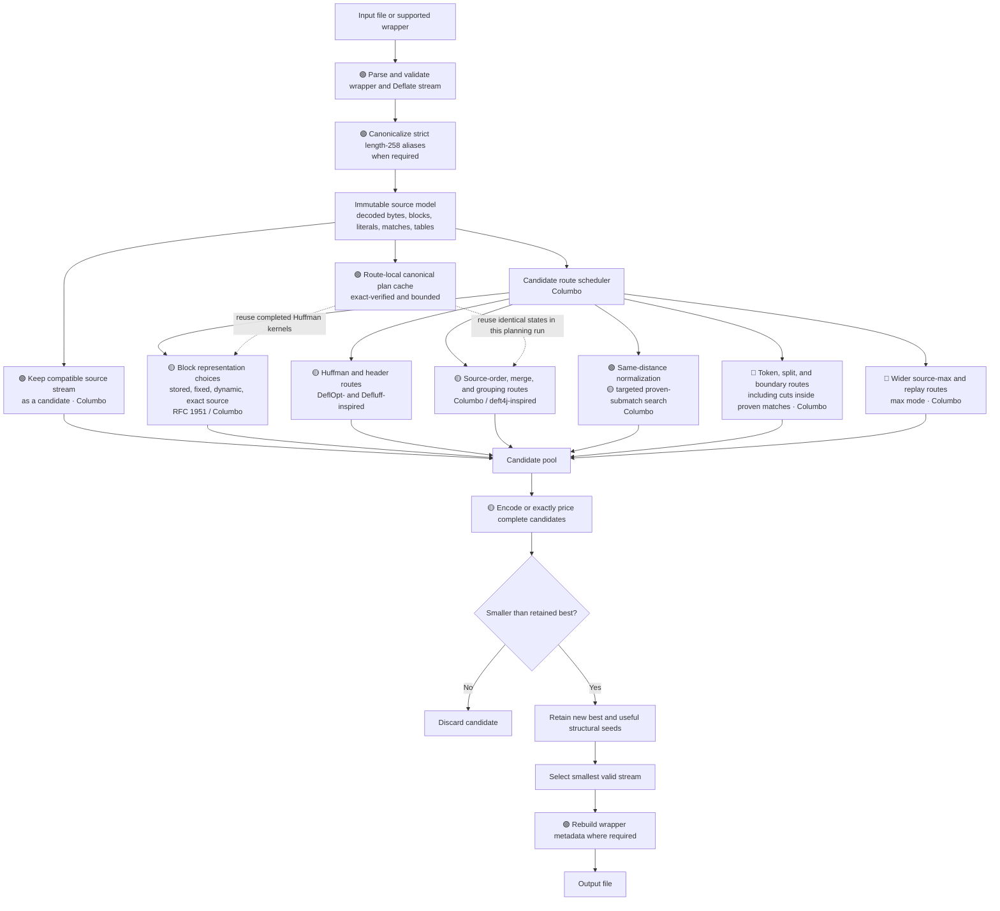
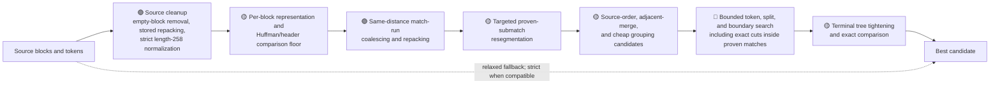
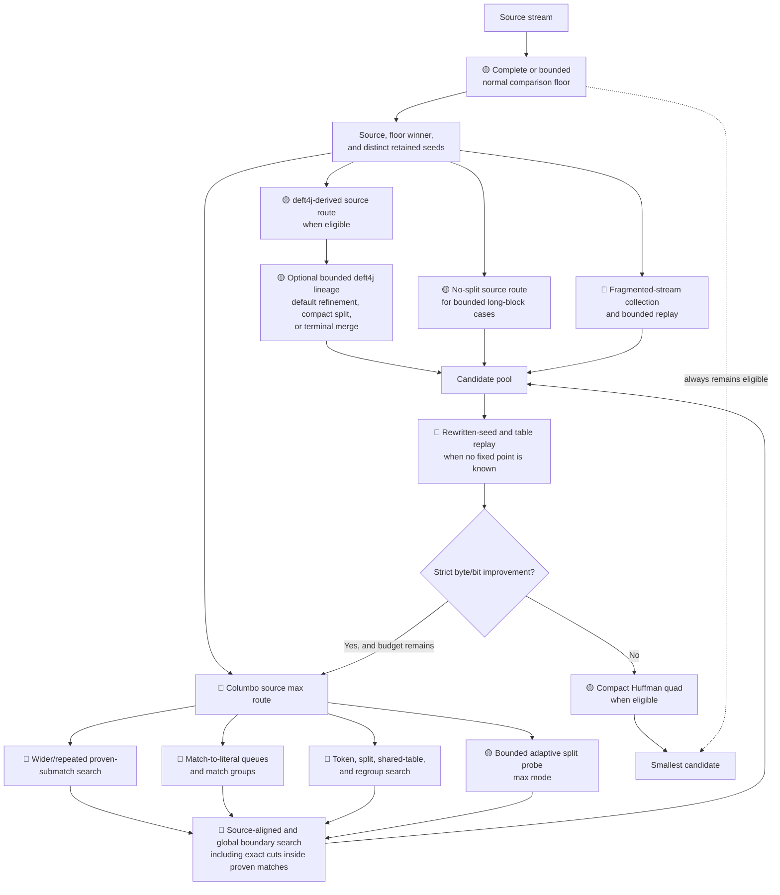
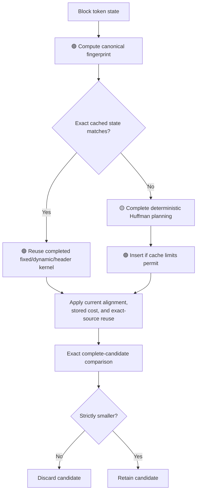

<!-- SPDX-License-Identifier: MIT -->

# Columbo routes and optimization methods

This document gives a conceptual view of how Columbo optimizes an existing
Deflate stream. It describes the candidate routes and their relationships, not
a promise that every route will run for every input. Columbo may gate, skip,
reuse, or stop routes when they cannot improve the current result.

Columbo is a **post-optimizer**. It preserves the decoded byte stream and works
from the literals, matches, blocks, and Huffman information already present in
the source. It does not run a new LZ77 match finder or recompress the input with
Zopfli, libdeflate, or another compressor.

## Speed legend

| Indicator | Speed | Meaning |
| --- | --- | --- |
| 🟢 | Fast | Small, bounded work; normally close to linear in the relevant block or token count. |
| 🟡 | Medium | Rebuilds or compares several candidate trees or block layouts. |
| 🔴 | Slow | Searches many token, table, merge, or boundary alternatives, including widened or repeated max-mode refinement. |

The indicators are relative. A route marked 🟢 can still take noticeable time
on a very large stream or a container holding many Deflate streams. When a
method straddles two categories, its indicator uses the slower endpoint.

## Overall pipeline

Generated alternatives are accepted only after exact comparison and only on a
strict complete-stream improvement. In relaxed mode, the original stream can
therefore remain the no-growth fallback. Strict mode has one necessary
exception: a source spelling that uses a noncanonical length-258 form or an
incompatible Huffman tree may have to be rewritten for compatibility, even
when the compliant result is larger.

## Default route

The default route aims for useful savings without allowing the most expensive
searches to dominate runtime. It first establishes a complete comparison floor:
a valid result that later optional work may improve but cannot displace with an
equal or larger candidate. In containers with a shared deadline, this also
prevents early members from consuming all useful optimization time.

Individual routes may start from the source candidate, the current best
candidate, or a structurally different retained seed. The diagram therefore
shows the usual information flow rather than a strict one-candidate pipeline.
The comparison floor also includes bounded match-to-literal and short
length-family candidates plus DeflOpt/Defluff-derived tree feedback.

## Max route

Max mode adds wider searches and additional refinement passes. It is intended
for cases where output size matters more than elapsed time. It retains the
normal comparison floor before considering max-only candidates. Small,
explicitly bounded container routes may run independently or in parallel;
their completed floor can be reused rather than rebuilt.

Repeated passes are useful only when an earlier transformation changes the
token frequencies, Huffman lengths, header RLE, block boundaries, or starting
bit alignment seen by a later method. A whole-stream replay continues only
after a strict byte/meaningful-bit improvement; an unexpired exhaustive replay
establishes a fixed point only when it reproduces the same bytes and bit count.
All timed routes share the file-wide deadline, and timeout returns the best
complete candidate already found.

## Candidate reuse and duplicate-work control

The canonical cache is bounded and local to one planning run. A hit verifies
the complete token spelling, symbol frequencies, source dynamic-tree seed, and
strict/default-or-max planning policy after the hash match. This exact check
also makes hash collisions harmless.

The cached Huffman kernel is deliberately alignment-independent. Stored-block
padding, exact-source reuse, and the current starting bit residue are layered
onto it afterward. Only completed deterministic plans are inserted; timed work
may reuse one but does not publish a partial plan. If the cache reaches its
limit of 512 entries or 16 MiB of conservatively charged retained token
storage, Columbo recomputes safely instead of changing the selected output.
Cache lookup statistics remain internal and are not part of verbose output.

## Same-distance match-run normalization

🟢 Consecutive matches with the same semantic distance form a proven run.
Columbo can coalesce a run whose combined length is at most 258 bytes. Longer
runs are repartitioned into the minimum legal number of 3–258-byte matches,
using the current Huffman costs for the small bounded partition search.

The method never changes the distance or searches the history window. Generated
length fields are canonical, the complete block is exactly repriced, and a
candidate is adopted only on a strict bit win. Default mode bounds pathological
partition searches; max mode retains the wider cost-guided search.

In verbose mode, Columbo reports source-only opportunity counters before route
search begins:

- Maximal same-distance runs.
- Matches and decoded bytes in those runs.
- Direct coalesces and longer repartition opportunities.
- The maximum number of removable match tokens.

The diagnostic scans the joined source token stream, so source block
boundaries—including empty blocks—are not artificial barriers. A literal or a
different distance ends the run. These counters describe the input once;
replayed and merged candidates do not inflate them.

## Proven-submatch resegmentation

Within one existing match, Columbo builds a small acyclic graph over decoded
positions:

- A literal edge emits the already-known decoded byte.
- A match edge emits 3–258 bytes at the original match distance.
- No edge extends beyond the source match's decoded interval.

This permits a literal prefix plus suffix match, a prefix match plus literal
suffix, several same-distance submatches, or combinations of those forms.
Overlapping references remain valid because every preceding edge reproduces the
same decoded prefix. Generated matches use canonical length fields and retain
all semantic distance fields.

The graph uses the current best Huffman costs when available, then the source
tree, then fixed-code costs. The exact source match wins estimated payload
ties. To expose header savings that this tie rule would otherwise hide,
Columbo also prices source-symbol-free paths and a bounded candidate that
removes every occurrence of the highest used length symbol. Materialized
candidates are deduplicated before complete Huffman and header planning.

| Mode | Indicator | Search policy |
| --- | --- | --- |
| Default | 🟡 | One pass over a ranked set of at most eight matches, with at most two per length symbol. Ranking favours the highest, rare, or expensive symbols, length-code transitions, and matches near source boundaries. Compact blocks may price up to four single-match siblings per rewrite family as well as combined candidates; highest-symbol elimination is limited to eight matches. |
| Max | 🔴 | Up to 32 ranked matches, with at most four per length symbol, or every eligible match in a compact bounded block. Compact blocks may price up to eight single-match siblings per rewrite family; highest-symbol elimination is limited to 64 matches. Strict winners repeat until stable, the deadline expires, or the 12-pass cap is reached. |

For ranking, a length symbol is rare at frequency two or less and expensive at
nine bits or more, or when it is absent from the seed tree. Transition checks
cover two decoded bytes on either side of a length-code change, and source
boundaries use an eight-byte radius. Single-match sibling pricing uses a tighter
compact band of 4,000 tokens and 80,000 decoded bytes.

Default eligibility is bounded to 50,000 tokens and 10,000,000 decoded bytes.
Max widens the token bound to 250,000; its full-match graph is restricted to
12,000 tokens, 80,000 decoded bytes, and 512 matches. These are work limits, not
format limits.

Every materialized spelling is rebuilt and exactly priced with its starting bit
alignment. It replaces the incumbent only when the complete Deflate block is
strictly smaller. Relaxed mode may additionally price the existing
compatibility spelling of length 258.

## Inside-match boundary polishing

🟡 A decoded boundary target can fall inside a match even when no token
boundary exists there. Columbo now retains the established snapped
token-boundary candidate and adds an exact sibling at the decoded target. It
does not pre-split every source token or search arbitrary decoded positions:
only an edge selected for exact pricing is materialized.

For each selected edge, a partial match of 3–258 bytes becomes one canonical
match at the source match's proven distance. A one- or two-byte remainder
becomes the corresponding known literals. Complete tokens keep their source
spelling. This permits a block boundary inside an overlapping match without
searching the history window or introducing a different distance.

Default mode adds exact siblings to the seven decoded-eighth probes for an
eligible source block and to its existing bounded runner-up midpoint
refinement. Combined-run and group probes keep their cheaper token-boundary
behavior. Max mode enables exact siblings for those wider probes within the
existing cut, token, decoded-size, and deadline limits. The boundary graph
carries the actual starting bit residue, so stored-block padding and every
fixed, dynamic, or source representation are compared at their true alignment.
The retained candidate must still be a strict complete-stream improvement.

| Mode | Indicator | Search policy |
| --- | --- | --- |
| Default | 🟡 | Adds exact siblings to eligible per-source decoded-eighth probes and bounded runner-up midpoint refinement while retaining every snapped candidate. |
| Max | 🔴 | Also enables exact siblings for combined runs and groups under the shared deadline and existing graph limits. |

## Scheduling and observability

🟡 The normal comparison floor is a complete, selectable candidate rather than
an estimate. Standalone max runs retain the completed normal result; bounded
PNG scheduling can reuse that result and spend only its remaining budget on
max-only routes. Multi-stream containers use a shared bounded floor so one
member cannot consume the file-wide deadline before later members are parsed
and validated. Eligible small bounded routes may run concurrently; larger
models keep deterministic serial ordering to cap peak memory.

`--dry-run` performs the complete optimization and reports its result without
writing an output file. It can be combined with `--verbose`, which reports
route timings, same-distance opportunities, candidate bit gains, the
`Pricing block boundaries` phase, the selected route, and the final block
plan. Verbose and quiet runs use identical optimization and memory policies.

## Method catalogue

| Method or route | Purpose | Indicator | Provenance |
| --- | --- | --- | --- |
| Original candidate preservation | Keeps a compatible already-optimal source stream available as the relaxed-mode fallback. | 🟢 | **Columbo** |
| Strict compatibility handling | Canonicalizes the length-258 alias before planning; strict block planning rejects exact reuse and emits a compatible replacement when a source dynamic alphabet is incompatible. | 🟢 | **RFC 1951 / Columbo** |
| All-stored block repacking | Repackages adjacent stored data into payloads of at most 65,535 bytes, removing redundant block headers without constructing match candidates. | 🟢 | **RFC 1951 / Columbo** |
| Exact source-block reuse | Retains source block bits when their alignment and compatibility remain valid. | 🟢 | **Columbo** |
| Stored/fixed/dynamic comparison | Chooses the cheapest legal complete representation, including alignment, payload, and header cost. | 🟡 | **RFC 1951**, implemented by Columbo |
| Route-local canonical plan cache | Reuses exact-verified, completed fixed/dynamic/header kernels across identical token states within a planning run. | 🟢 | **Columbo** |
| Same-distance match-run normalization | Coalesces or cost-guidedly repartitions adjacent matches that already use one proven distance. | 🟢 | **Columbo** |
| Length-limited Huffman construction | Builds legal literal/length and distance code lengths. | 🟡 | General **Package-Merge / length-limited Huffman** method |
| Code-length RLE and header variants | Searches alternative encodings of dynamic Huffman tables. | 🟡 | **DeflOpt-inspired** where labelled in source; Columbo implementation |
| Huffman feedback passes | Rebuilds tables after changed symbol costs or populations until no useful improvement remains. | 🟡 | **Defluff-inspired** where labelled in source |
| Terminal tree tightening | Applies bounded feedback trees and one strictly improving match-to-literal table replay to eligible final Huffman blocks, retaining only a smaller alignment-independent result. | 🟡 | **DeflOpt-inspired primitive / Columbo scheduling** |
| Source-order and adjacent-merge variants | Prices source-derived blocks in order and tests compatible neighbouring merges. DeflOpt contributes only the exact ten-bit fixed/fixed join; broader merging is Columbo. | 🟡 | **DeflOpt / Columbo**; per-block tree work retains its stated attribution |
| Dedicated deft4j-derived source route | Runs the bounded source-derived deft4j comparison route when max-mode eligibility permits. | 🟡 | **deft4j-inspired** where labelled in source |
| Relaxed tree and length variants | Enables explicitly selected compatibility-risk optimizations when `--strict` is disabled. | 🟡 | Deflate implementation knowledge; **Columbo integration** |
| Match-to-literal alternatives | Replaces selected existing matches with their decoded literals when complete repricing finds a gain. | 🔴 | **Columbo**; deft4j-compatible variants retain deft4j attribution where applicable |
| Targeted proven-submatch resegmentation | Searches a bounded ranked set inside already-proved source matches. | 🟡 | **Columbo** |
| Wider and repeated proven-submatch resegmentation | Widens the graph search in max mode and repeats strict winners to stability or a cap. | 🔴 | **Columbo** |
| Bounded inside-match boundary polishing | Retains snapped per-source probes and also prices their exact cuts inside proven matches, spelling each selected fragment canonically at the same distance or as one or two known literals. | 🟡 | **Columbo** |
| Wider inside-match boundary polishing | In max mode, extends exact inside-match siblings to combined runs and groups under the shared deadline and graph limits. | 🔴 | **Columbo** |
| Candidate-family and cumulative expansion | Evaluates related match expansions together rather than only in isolation. | 🔴 | **Columbo** |
| Source-aligned floor | Prices at most 36 contiguous source ranges across at most eight blocks, then selects a grouping before wider searches. | 🟡 | **Columbo** |
| Bounded lookahead grouping | Considers spans of up to 16 across as many as 128 source blocks, commits the strict best saving at each position, and continues after the chosen group. | 🟡 | **Columbo** |
| Fragmented-stream collection and replay | Collects highly fragmented source material and revisits bounded structural candidates. | 🔴 | **Columbo** |
| Token and split search | Searches token transformations together with alternative block splits. | 🔴 | **Columbo** |
| Shared-table and regroup search | Tests whether adjacent material is cheaper under a common tree or a different grouping. | 🔴 | **Columbo** |
| Adaptive split probe | In max mode, samples, smooths, and narrows a bounded coarse-to-fine boundary search, then accepts one cut only after exact token-preserving replanning and at least a 32-bit saving. | 🟡 | **Turtledeflate-inspired search shape; Columbo implementation** |
| Global boundary graph | Searches a wider graph of block boundaries and representations. | 🔴 | **Columbo** |
| No-split source route | Narrowly searches every original Huffman block and greedily retries profitable adjacent pairs while omitting grouping, split probes, boundary search, and iterative replay. | 🟡 | **Columbo** |
| Source max route | Applies the broadest source-derived token, table, split, and merge search. | 🔴 | **Columbo** |
| Rewritten-seed and table replay | Re-runs structurally useful seeds under changed table costs. | 🔴 | **Columbo** |
| Compact split floor | Prices one decoded-eighth split per source block, retaining either the block or at most two exact-planned children. | 🟡 | **Columbo** |
| Compact quad-lengthening floor | On one finished dynamic tree, shortens one code and lengthens four others with equal Kraft weight, under bounded candidate and header trials. | 🟡 | **Columbo** |
| Fixed-point suppression | Stops replay after an exhaustive pass reproduces the same bytes and meaningful bit count. | 🟢 | **Columbo** |
| Terminal merge | Refines an eligible completed deft4j-derived seed with a linear adjacent merge pass and, while budget remains, at most two ordinary replays. | 🟡 | **Columbo** |
| Exact winner selection | Compares meaningful Deflate bits and final output bytes, retaining the best valid result. | 🟢 | **Columbo** |

## Attribution

The acknowledgements describe algorithmic inspiration and behavioral
reconstruction. They do not imply that Columbo contains directly copied source
code from these programs.

- **DeflOpt**, by Ben Jos Walbeehm — existing-stream Deflate optimization,
  particularly strong dynamic-header transformations and the exact ten-bit
  fixed/fixed block join. Columbo's arbitrary merging and regrouping remain
  independent methods. The public reverse-engineering discussion is
  [Ben Jos Walbeehm's DeflOpt: what does it actually do?](https://encode.su/printthread.php?page=1&pp=30&t=455).
- **defluff**, by Joachim Henke (`jo.henke`) — repeated Huffman optimization of
  existing Deflate streams and data-section-aware feedback. See
  [defluff — a deflate Huffman optimizer](https://encode.su/threads/1214-defluff-a-deflate-huffman-optimizer).
- **deft4j**, by `NeRd` — existing-stream Deflate and archive optimization,
  including minimum-code and structural behaviors reconstructed by the
  corresponding Columbo section. See
  [deft4j and JarTighten](https://encode.su/threads/4112-deft4j-amp-JarTighten-yet-another-deflate-stream-amp-Zip-optimiser).
- **Turtledeflate**, by Ralf Willenbacher — inspiration for cumulative
  global/partial range histograms and the sample–smooth–narrow shape of
  Columbo's independently bounded adaptive split probe; it was also reviewed
  for repeated boundary refinement and avoiding repeated work. Its full LZ77
  path search and randomized recompression are outside Columbo's scope. See
  [Turtledeflate](https://github.com/rwillenbacher/turtledeflate).
- **Zopfli**, by Google — useful public reference for length-limited Huffman
  construction, header-aware histogram adjustment, and block splitting. Its
  LZ77 recompression is outside Columbo's scope. See
  [Zopfli](https://github.com/google/zopfli).
- **RFC 1951**, by L. Peter Deutsch — normative description of the Deflate
  format. See [RFC 1951](https://www.rfc-editor.org/rfc/rfc1951).

## Scope boundary

### Inside Columbo

- Parse existing Deflate streams.
- Reuse or rewrite Huffman tables.
- Repack stored blocks or choose stored, fixed, or dynamic representations.
- Coalesce or repartition same-distance match runs.
- Replace selected existing matches with their decoded literals.
- Resegment proven matches at their original distance.
- Merge, split, and regroup blocks, including bounded boundaries inside proven
  matches.
- Compare exact output sizes.

### Outside Columbo

- Searching the 32 KiB history for new matches.
- Choosing new alternative match distances.
- Running Zopfli or libdeflate recompression.
- Using randomized LZ77 path tracing.

Proven-submatch resegmentation does not search the history window or invent a
distance. Every generated match remains inside an interval already proved by
the source token and retains that token's distance. Inside-match boundary
polishing obeys the same constraint: it only divides a proven source match at
an exact decoded boundary, then prices the resulting complete block layout.
